# HeartBeat — BLE 心率监测系统（HRMLink / HRHub / HRBubble）

> 老爷子爆发性心肌炎出院后，家里需要个东西 24 小时盯着心率。
> 买监护仪？太贵。指望手环厂商的预警？要订阅，还是黑盒。
> 正好：手环的蓝牙心率广播谁都能收——捡垃圾收来的智能盒子、吃灰的 NUC，正好派上用场。得，废物利用，自己搓一个。

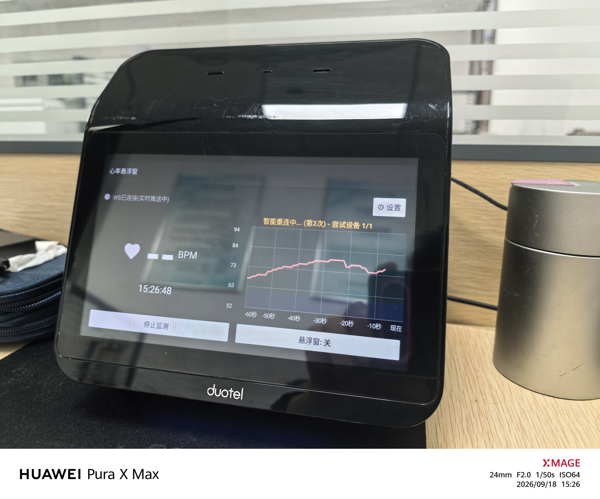

---

## 为什么要做这个

去年老爷子突发**爆发性心肌炎**——这病起病急、进展快，凶险得很，万幸抢救及时，住院治疗一段时间后总算平稳了。

但出院的时候医生交代：这病得做**院外跟踪管理**，回家心率还得天天盯着——老爷子的正常心率范围是 **50–80 次/分**，超出这个区间、或者出现**房颤**之类的心律不齐，都是危险信号，一旦发现要马上处理、马上就医。

问题来了：怎么盯？

- 医院那种监护仪——太贵，家里也不是病房
- 24 小时 Holter——只能穿一两天，解决不了长期的事
- 智能手表/手环——思路其实最靠谱，但厂商 App 的路数是"手环连病人自己的手机"：数据锁在他手机里，家属根本看不到，预警再准也够不着家人；房颤筛查不是要订阅，就是黑盒不放心

后来想通了一件事：**手环测心率本来就够用了**。只要开着心率监测，它就会通过标准蓝牙（BLE）把心率实时广播出来，谁都能收——不非得连他自己的手机。缺的只是一个"自己说了算"的判断和提醒环节。

而这个环节，正好可以用家里的闲置来补：

- 一台 **Duotel Cube 智能盒子**——酒店客房一体机，厂家项目黄了，全新库存百来块包邮甩卖。MTK8167 + 7 寸屏 + 安卓 8.1，捡垃圾经典款（[开箱介绍看这里](https://post.smzdm.com/p/a5o7ngq8/)）
- 一台吃灰好几年的 **NUC 小主机**，开机照样能跑
- 再加一只**智能手环**——支持蓝牙心率广播的普通手环就行，要买也就百来块

得，都别闲着，开工。

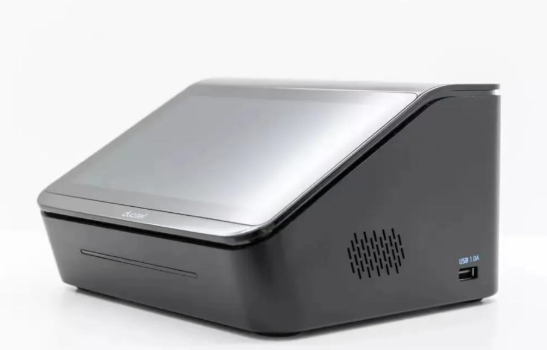

| 家里的闲置 | 之前的命运 | 现在的活儿 |
|---|---|---|
| NUC 小主机 | 吃灰 | 当服务端：24 小时收心率、判断异常、发通知 |
| Duotel Cube 智能盒子 | 抽屉吃灰 | 放我办公室桌上，挂着悬浮气泡显示实时心率 |
| 智能手环 | 老爷子戴着 | 蓝牙心率广播，数据从这里来 |

## 现在是这个效果

老爷子手腕上戴个手环，心率通过蓝牙实时广播出来，家里的 NUC 全天候接着。一发现**心律不齐**（房颤的苗头）或者**心率飙了/掉了**，立马往全家人的手机上推消息。

我的办公室工位上还摆着那台 Duotel 盒子，打开 HRBubble，老爷子的实时心率常驻屏幕——上班的时候一抬眼就能瞄一眼，心里踏实。这玩意儿本来是酒店客房中控，屏幕天生带仰角，放桌上正合适。

一套下来：捡来的盒子 + 旧电脑 + 一只普通手环（要买也就百来块），没有月费，数据全在自己手里，连云服务器都不用。

省多少钱是小事，老爷子真有情况能第一时间知道，才是大事。

```
手环/手表（蓝牙心率广播）──► NUC（服务端）──► 全家人的手机（告警推送）
                    │
                    └──Tailscale──► 办公室的 Duotel 盒子（悬浮气泡显示）
```

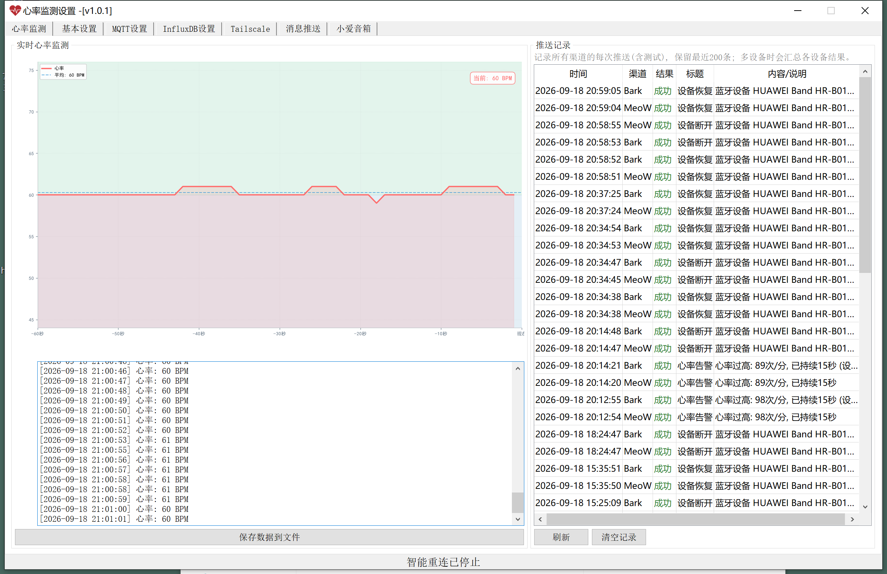

**告警推送到手机，长这样**：

| 安卓通知栏（MeoW 渠道） | iPhone（Bark 渠道） |
|---|---|
| 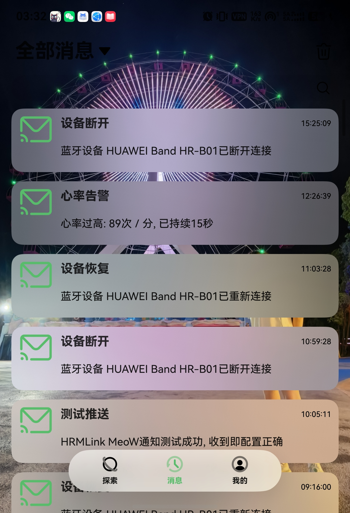 | 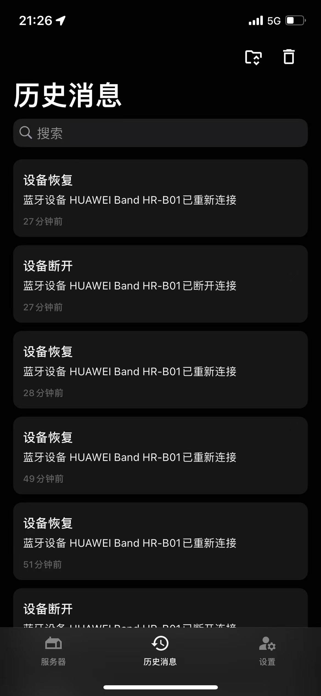 |

> [!WARNING]
> **丑话说在前面**：这是自己攒的玩意儿，**不是医疗器械**，替代不了医院的专业设备和医嘱，告警也可能漏报、误报。真觉得不舒服，别犹豫，赶紧去医院。

---

## 三个软件分别是干嘛的

| 组件 | 装在哪 | 干嘛的 |
|---|---|---|
| **HRMLink** | Windows 电脑（我的 NUC 跑的就是它） | 连手环、收心率、画波形、判断异常、发通知 |
| **HRHub** | 安卓设备（手机/平板/盒子） | 和 HRMLink 干一样的活，没电脑也能用安卓设备顶上 |
| **HRHub** | 鸿蒙设备 | 鸿蒙版接收端：Tailscale 组网 + BLE 心率 + 悬浮气泡，功能对齐安卓接收端 |
| **HRBubble** | 安卓设备（我家跑在 Duotel 盒子上） | 只管显示：连上服务端，悬浮气泡实时显示心率 |

> 服务端二选一：有闲置电脑就用 HRMLink，没电脑就找个安卓设备跑 HRHub；HRBubble 配哪个都行。

## 界面长什么样

**安卓端两个 App**：

| HRHub（安卓服务端） | HRBubble（安卓接收端） |
|---|---|
| 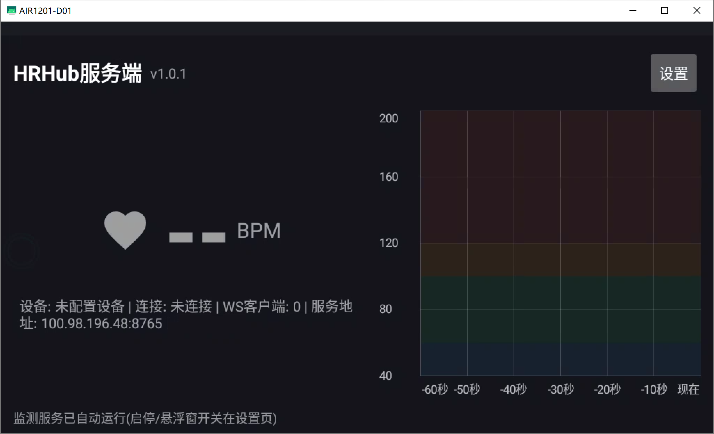 | 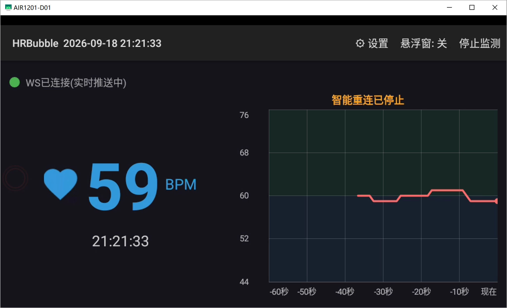 |

**HRMLink 的各个设置页**：

| 设备管理 | 消息推送/告警规则 | Tailscale |
|---|---|---|
| 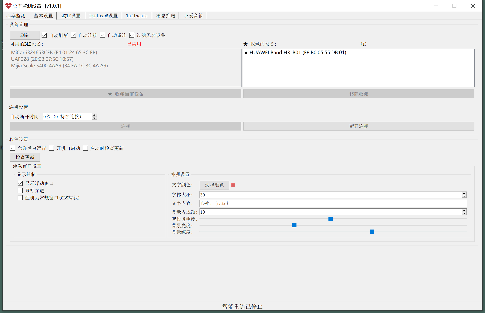 | 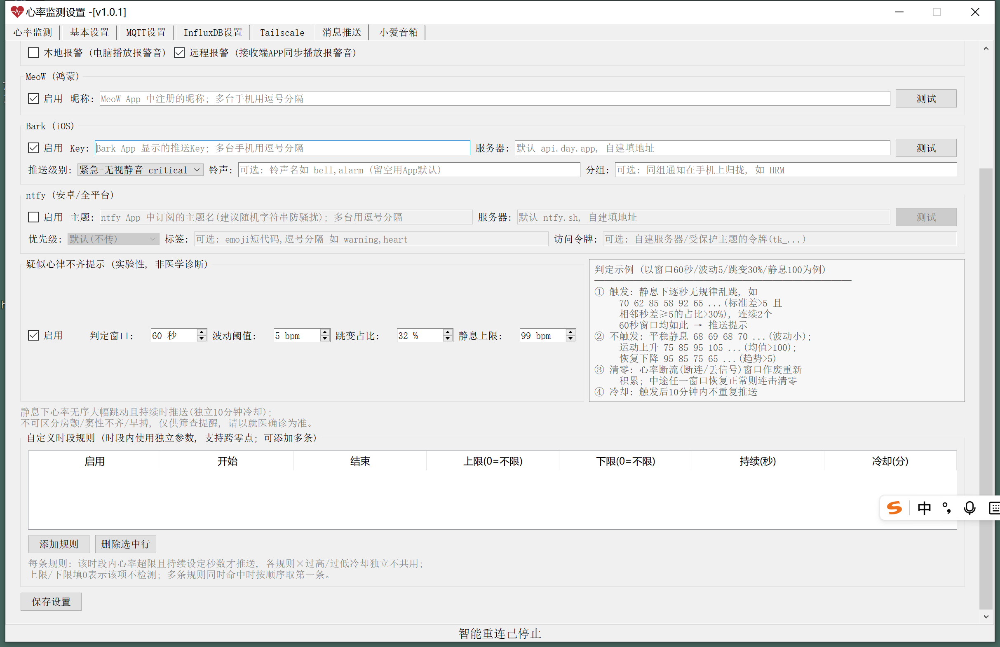 | 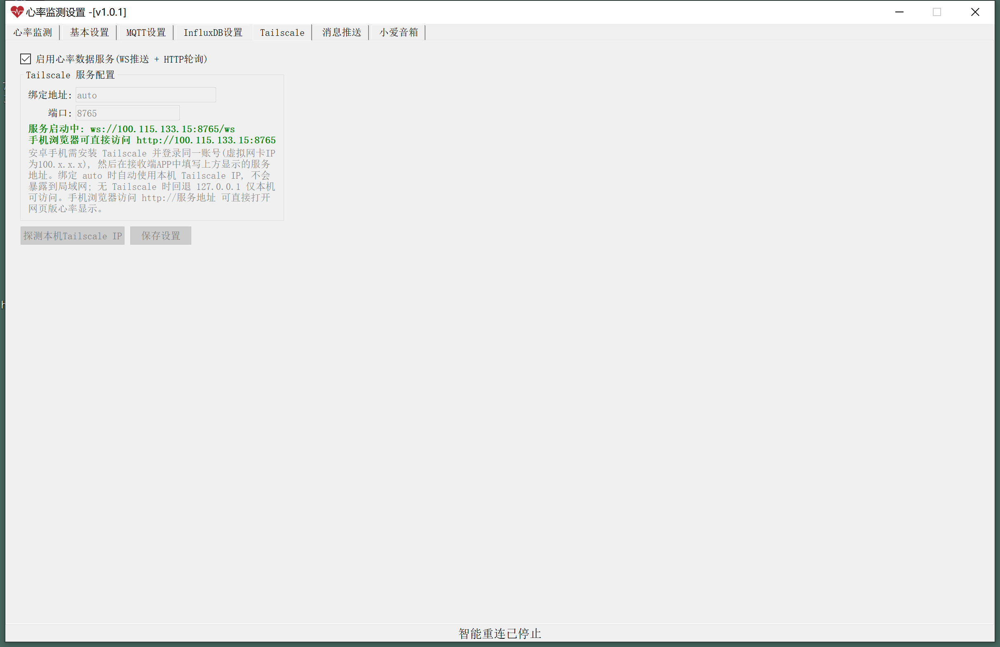 |

| MQTT | InfluxDB | 小爱音箱 |
|---|---|---|
| 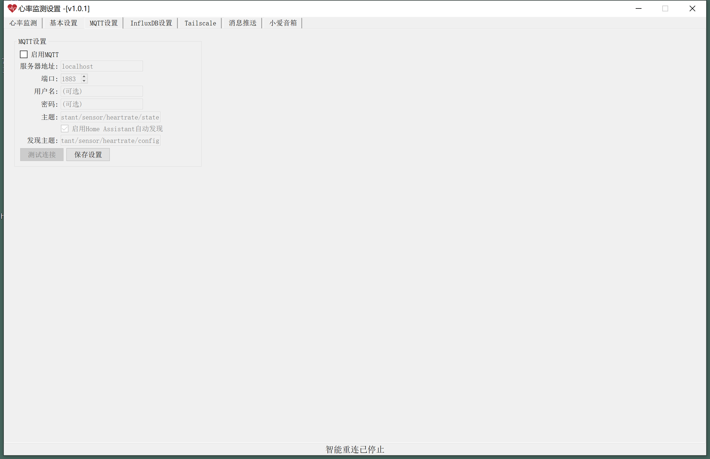 | 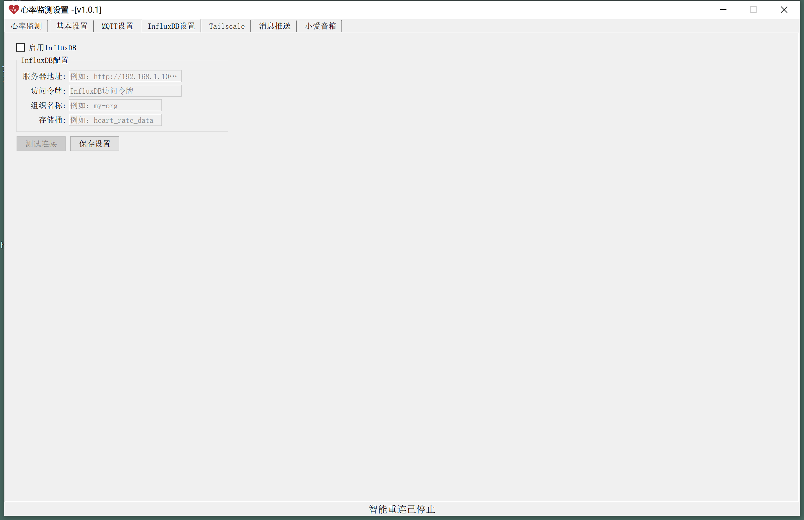 | 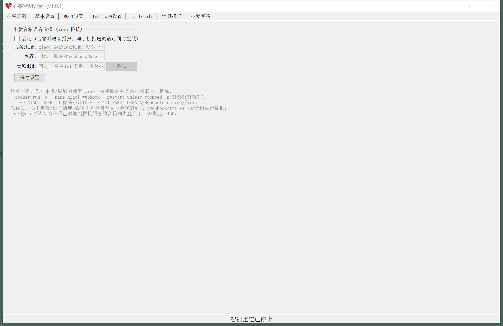 |

## 功能特点

### 心率监测（桌面端 HRMLink）
- BLE 心率手环连接（支持收藏设备、自动连接、智能重连）
- 实时心率波形图（独立监测页）
- 心律不齐检测（波动阈值 / 跳变占比 / 静息上限可调）
- 桌面悬浮窗口（透明度 / 亮度 / 纯度可调，支持 OBS 捕获）

### 安卓服务端（HRHub，与桌面端能力对等）
- 直连 BLE 手环采集：可见扫描列表 + 收藏设备 + 智能重连（最后连接→收藏轮换，连续 3 轮失败自动停止）
- 数据服务：WebSocket 推送 + HTTP 轮询兜底，协议与桌面端完全一致，绑定 Tailscale IP（auto 自动探测）
- 告警引擎：心率上下限、持续判定、检测时段、告警冷却、心律不齐检测
- 多渠道推送：Bark（iOS）/ ntfy / MeoW（鸿蒙）；数据输出：InfluxDB / MQTT（Home Assistant 自动发现）
- 配置即运行：收藏/保存设备后立即自动连接，前台服务常驻（被系统杀死自动拉起）
- 心率悬浮窗（开关在设置页）；推送记录页查看最近 50 条告警

### 数据记录与分析（桌面端）
- 心率数据自动按天保存为 CSV（`log/heart_rate_YYYY-MM-DD.csv`）
- 内置统计分析与可视化脚本（见 [心率日志记录说明.md](心率日志记录说明.md)）

### 数据推送（桌面端）
- **MQTT**：发送到 Home Assistant 等智能家居平台，支持自动发现
- **InfluxDB**：时序数据库存储
- **多渠道手机通知**：MeoW（鸿蒙）/ Bark（iOS）/ ntfy
- 推送规则：心率超限（上限/下限）、检测时段、告警冷却、心律不齐告警

### 其他
- 敏感配置（桌面端 MQTT 密码 / InfluxDB Token）使用 Windows DPAPI 加密存储
- 桌面端系统托盘常驻、开机自启、自动检查更新

## 最新更新 v1.1.1（2026-09-25）

- **报警视频联动**：心率报警时，自动把报警房间绑定的摄像头画面推送到接收端（房间→摄像头绑定在桌面端"摄像头"页配置）
- **HLS 实时直播**：报警联动支持真直播流（640×360@15fps H.264，约 400kbps），直播失败自动回退快照轮询，1G 内存的接收端也带得动
- **ESP32 中继信号标定**：可标定各节点 RSSI 硬件偏差，仲裁选路更准（桌面端"ESP32中继"页）
- **小爱音箱**：登录错误提示友好化（密码错误/验证码风控等）
- 三端（EXE / 安卓接收端 / 鸿蒙接收端）版本同步 1.1.1

## 下载与运行

### 桌面端 HRMLink
**方法 1**（推荐）：源码运行 —— 下载 zip 解压后，根据需要修改 [`start.bat`](start.bat) 中的 Python 路径，双击运行即可
- 优点：随时可以检查与修改代码
- 缺点：运行环境需要自己配置

**方法 2**（推荐）：下载编译好的程序 —— 前往 [Releases 页面](https://github.com/a191442029/HeartBeat/releases/latest) 下载 `HRMLink-v1.1.1.exe`，双击运行
- 优点：门槛低，单文件双击即可运行
- 缺点：相对不太透明，exe 体积较大

**方法 3**：自行编译 —— 安装 `pyinstaller` 后运行 `build_standalone.bat`，详见 [编译EXE指南.md](编译EXE指南.md)

如果运行出现依赖缺失错误，通过命令行手动安装（推荐 Python 3.13）：

```
pip install pyqt5 qasync bleak paho-mqtt influxdb-client aiohttp
pip install matplotlib numpy    # 数据分析/可视化脚本需要（可选）
```

### 安卓端 / 鸿蒙端
从 [Releases 页面](https://github.com/a191442029/HeartBeat/releases/latest) 下载侧载安装：
- `HRBubble-v1.1.1-hls-live.apk` —— 安卓接收端（Android 8.0+）
- `HRHub-1.0.0.apk` —— 安卓服务端
- `HRHub-v1.1.1.hap` —— 鸿蒙接收端（HarmonyOS）

鸿蒙 HAP 侧载：需要用 DevEco Studio 的 hdc 工具安装（`hdc install HRHub-v1.1.1.hap`）。

## 怎么搭一套（两种玩法）

**方案 A：电脑当服务端（我家的用法：NUC 在家长期通电，Duotel 盒子放公司，跨网全靠 Tailscale 打通）**
1. 电脑和安卓设备都装好并登录**同一个 Tailscale 账号**
2. 电脑端 HRMLink "Tailscale"页打开服务（地址填 `auto` 就行），端口默认 `8765`
3. 安卓设备装 `HRBubble`，把悬浮窗权限和电池白名单给上
4. 设备里填电脑的 Tailscale IP + 端口，悬浮气泡就有心率了

**方案 B：安卓设备当服务端（没有闲置电脑的话）**
1. 全部设备登录同一 Tailscale 账号
2. 安卓设备装 `HRHub`，给上定位（搜蓝牙用）、悬浮窗权限和电池白名单
3. 设置页扫一下、收藏手环（存好就自动连），数据服务默认就开着
4. 其他设备的 `HRBubble` 填这台安卓设备的 Tailscale IP + 端口就行

## Q&A

#### Q: 蓝牙也开了，为什么就是扫不到手环？

- **A:** 先看看手环的心跳广播开了没有。开了还找不到的话，先进系统的蓝牙设置页再退回来，点一下刷新，经常就好了。

#### Q: 怎么卸载 HRMLink？

- **A:** 程序只往 exe 所在的文件夹写东西。卸载前先点`关闭开机自启`，然后：
  - 直接删掉 `HRMLink.exe` 所在文件夹；
  - 或者只删 `HRMLink.exe`、`config.ini` 和 `log` 文件夹（里面是设置、日志和心率数据）。

#### Q: 心率数据怎么发给 Home Assistant？

- **A:** "MQTT"设置页启用 MQTT、填好服务器地址，勾上"启用 Home Assistant 自动发现"，心率传感器就会自己出现在 HA 里。要账号密码就填上。安卓服务端 HRHub 也一样，在设置页 MQTT 分组里配。

#### Q: 心率数据存在哪？怎么看历史？

- **A:** 桌面端在 `log` 文件夹下的 CSV 文件（`heart_rate_YYYY-MM-DD.csv`），Excel/WPS 直接打开就能看，项目里也带了分析脚本。详见 [心率日志记录说明.md](心率日志记录说明.md)。

## 相关文档

- [架构文档.md](架构文档.md) —— 系统架构、模块说明、配置项
- [编译EXE指南.md](编译EXE指南.md) —— 从源码编译 Windows 程序
- [心率日志记录说明.md](心率日志记录说明.md) —— 心率日志与分析工具
- [安卓接收端方案.md](安卓接收端方案.md) —— Tailscale + 安卓悬浮窗方案设计

## License

本项目基于 [GPL-3.0](LICENSE) 协议开源。
