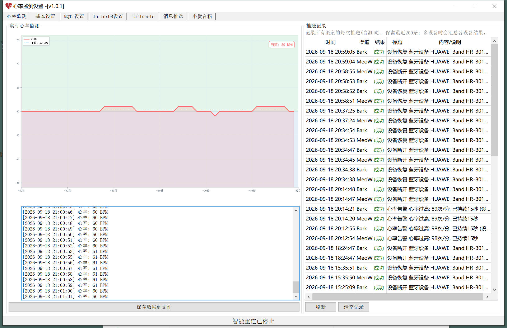
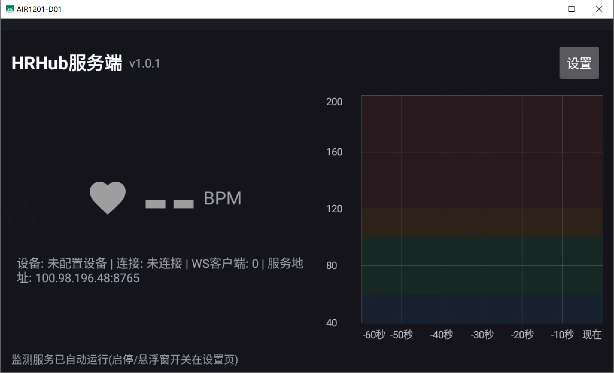
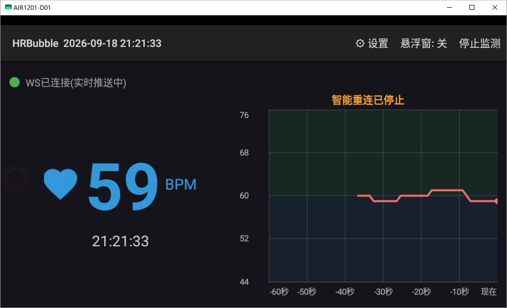
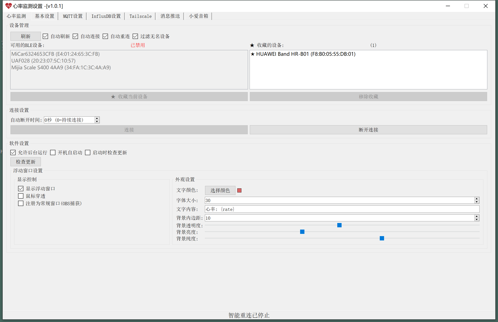
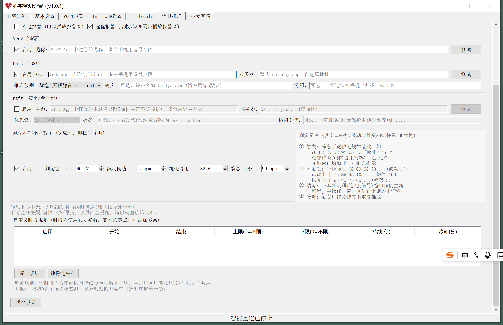
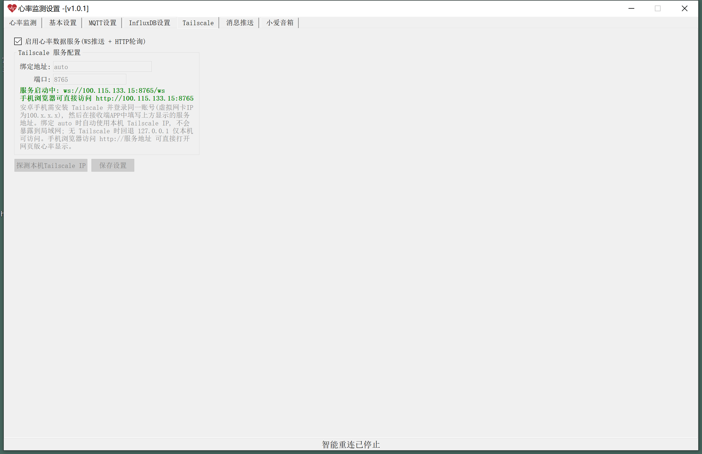
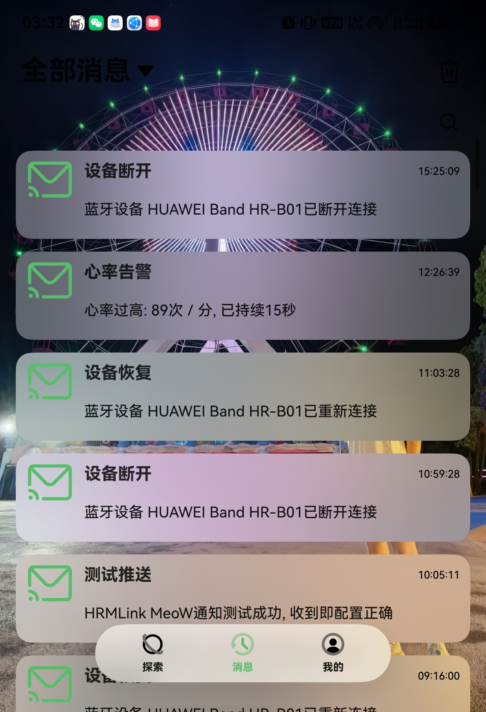
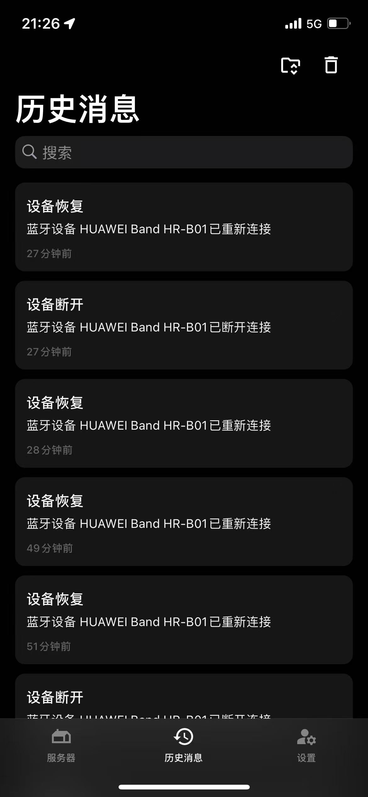

# HeartBeat — BLE 心率监测系统（HRMLink / HRHub / HRBubble）

> 一套开箱即用的家庭心率监测方案：普通蓝牙心率手环 + 闲置电脑/安卓设备 + 可选的 ESP32 中继节点，实现 24 小时心率监测、异常告警推送、多房间信号覆盖。无需云服务器、无订阅费、数据全部留在本地。



> [!WARNING]
> **不是医疗器械**，替代不了医院的专业设备和医嘱，告警也可能漏报、误报。身体不适请及时就医。

---

## 系统架构

```
手环/手表（蓝牙心率广播）──► ESP32 中继节点 ×N（各房间布点，中枢自动仲裁选一路）──► 服务端 ──► 手机（告警推送）
        │                                                                      │
        └── 手环就在服务端跟前时，蓝牙也可直连（无需节点）                        └──Tailscale──► 异地设备（实时查看）
```

BLE 信号穿墙衰减厉害，PC 内置蓝牙隔一堵墙可能就收不到了。在各房间放一个 ESP32 节点负责"听"手环广播，中枢自动选择信号最好的节点建立连接，人走到哪心率不断流。详见 [ESP32 中继网络](#esp32-中继网络多房间覆盖)。

## 组件

| 组件 | 装在哪 | 干嘛的 |
|---|---|---|
| **HRMLink** | Windows 电脑 | 服务端：连手环、收心率、画波形、判断异常、发通知，兼管 ESP32 节点仲裁 |
| **ESP32 中继节点** | 各房间，USB/插座供电（可部署任意数量） | 听手环广播报 RSSI，被中枢选中后负责建立 BLE 连接、回传心率 |
| **HRHub** | 安卓设备 | 安卓服务端：与 HRMLink 能力对等，没电脑也能用安卓设备顶上 |
| **HRHub** | 鸿蒙设备 | 鸿蒙版接收端：Tailscale 组网 + BLE 心率 + 悬浮气泡 |
| **HRBubble** | 安卓设备 | 接收端：连上服务端，悬浮气泡实时显示心率 |

> 服务端二选一：有闲置电脑就用 HRMLink，没电脑就用安卓设备跑 HRHub；HRBubble 配哪个都行。

**安卓端两个 App**：

| HRHub（安卓服务端） | HRBubble（安卓接收端） |
|---|---|
|  |  |

**HRMLink 的各个设置页**：

| 设备管理 | 消息推送/告警规则 | Tailscale |
|---|---|---|
|  |  |  |

**告警推送到手机**：

| 安卓通知栏（MeoW 渠道） | iPhone（Bark 渠道） |
|---|---|
|  |  |

## 功能特点

### 心率监测（桌面端 HRMLink）
- BLE 心率手环连接（支持收藏设备、自动连接、智能重连）
- **手环三态状态显示**：正常（已连接、数据流正常）/ 无数据（连着但心率停了，可能摘下充电）/ 失联（搜索不到，可能外出或关机），状态变化自动写入心率日志
- 实时心率波形图（独立监测页）
- 心律不齐检测（波动阈值 / 跳变占比 / 静息上限可调）
- 桌面悬浮窗口（透明度 / 亮度 / 纯度可调，支持 OBS 捕获）

### ESP32 中继网络（多房间覆盖）
- **布点自由**：ESP32 节点插上电就算上岗，可部署任意数量
- **中枢仲裁**：节点只做两件事——24 小时听手环广播报 RSSI、听中枢的命令建连接；哪个房间信号好用哪个，人走动时自动切换（带迟滞防抖动），心率不断流；报警期间冻结切换，保证数据连续
- **桌面端管理页**（"ESP32中继"设置页）：中继总开关、节点列表实时表格（节点名 / IP / 固件 / 状态 / 手环RSSI / 偏差dB / 最后活跃）、仲裁参数可视化调节（切换阈值 / 迟滞 / 冻结周期 / 信号门槛）
- **信号标定**：不同 ESP32 有 3~8dB 个体射频偏差会导致选路误判，设置页内置"并排同位标定"（约 30 秒），自动均衡个体偏差；选路用校准值、门槛用原始值双轨制
- **节点零配置上手**：首次通电节点自己开热点（`HRM-Link-xxx`，密码 `12345678`），手机连上去在 `192.168.4.1` 填 WiFi 和中枢地址就完事；之后固件升级走 WiFi OTA，不用再拆机插线
- **全链路遥测**：每个节点听到多少广播包、手环 RSSI 多少、连接卡在哪一步（`ble_fail` 阶段码），中枢日志全有，远程排障不用到现场
- **固件开源**：`ESP32/hr_relay_nimble`（NimBLE 栈主力版，Flash 占用 72%）与 `ESP32/hr_relay`（Bluedroid 栈对照版）；设计取舍见 [ESP32/设计决策.md](ESP32/设计决策.md)

### 安卓服务端（HRHub，与桌面端能力对等）
- 直连 BLE 手环采集：可见扫描列表 + 收藏设备 + 智能重连（最后连接→收藏轮换，连续 3 轮失败自动停止）
- 数据服务：WebSocket 推送 + HTTP 轮询兜底，协议与桌面端完全一致，绑定 Tailscale IP（auto 自动探测）
- 告警引擎：心率上下限、持续判定、检测时段、告警冷却、心律不齐检测
- 多渠道推送：Bark（iOS）/ ntfy / MeoW（鸿蒙）；数据输出：InfluxDB / MQTT（Home Assistant 自动发现）
- 配置即运行：收藏/保存设备后立即自动连接，前台服务常驻（被系统杀死自动拉起）
- 心率悬浮窗（开关在设置页）；推送记录页查看最近 50 条告警

### 数据记录与分析（桌面端）
- 心率数据自动按天保存为 CSV（`log/heart_rate_YYYY-MM-DD.csv`）
- 内置统计分析与可视化脚本（见 [心率日志记录说明.md](心率日志记录说明.md)）

### 数据推送（桌面端）
- **MQTT**：发送到 Home Assistant 等智能家居平台，支持自动发现
- **InfluxDB**：时序数据库存储
- **多渠道手机通知**：MeoW（鸿蒙）/ Bark（iOS）/ ntfy
- 推送规则：心率超限（上限/下限）、检测时段、告警冷却、心律不齐告警
- **报警视频联动**：心率报警时自动把绑定摄像头的画面推送到接收端（支持 HLS 直播流，失败自动回退快照轮询）

### 其他
- 敏感配置（桌面端 MQTT 密码 / InfluxDB Token）使用 Windows DPAPI 加密存储
- 桌面端系统托盘常驻、开机自启、自动检查更新

## 更新日志

### v1.1.5（2026-09-26）
- **心率 1 秒上报**：中继链路节流从 5 秒收紧到 1 秒，波形更跟手
- **手环三态状态显示**：心率监测页新增状态条，状态变化自动记录日志
- **报警音完整播放**：本地报警声从"循环播 10 秒"改为完整播放一遍自然结束
- **ESP32 中继固件 v1.1.6n（NimBLE 栈）**：重写 BLE 层，Flash 占用 97% → 72%，支持连接后实时 RSSI 采样，扫描吞吐与 Bluedroid 持平
- **多节点实测**：5 节点部署验证通过，节点配网/上线/OTA 全流程免拆机

### 历史版本
- **v1.1.4**：ffmpeg 从 EXE 分离（146MB → 约 50MB），独立部署到程序目录 `bin\`
- **v1.1.3**：修复启动早期扫描 "no running event loop"、设备列表空白
- **v1.1.2**：修复旧版 Win10 扫描报 "property is not available"
- **v1.1.1**：报警视频联动（HLS 直播）、ESP32 中继 RSSI 标定、小爱音箱登录提示友好化；三端版本同步

## 下载与运行

### 桌面端 HRMLink

**方法 1**（推荐）：源码运行 —— 下载 zip 解压后，根据需要修改 [`start.bat`](start.bat) 中的 Python 路径，双击运行即可
- 优点：随时可以检查与修改代码
- 缺点：运行环境需要自己配置

**方法 2**（推荐）：下载编译好的程序 —— 前往 [Releases 页面](https://github.com/a191442029/HeartBeat/releases/latest) 下载 `HRMLink-v1.1.5.exe`，双击运行
- 优点：门槛低，单文件双击即可运行
- 缺点：相对不太透明，exe 体积较大

**方法 3**：自行编译 —— 安装 `pyinstaller` 后运行 `build_standalone.bat`，详见 [编译EXE指南.md](编译EXE指南.md)

如果运行出现依赖缺失错误，通过命令行手动安装（推荐 Python 3.13）：

```
pip install pyqt5 qasync bleak paho-mqtt influxdb-client aiohttp
pip install matplotlib numpy    # 数据分析/可视化脚本需要（可选）
```

### 安卓端 / 鸿蒙端
从 [Releases 页面](https://github.com/a191442029/HeartBeat/releases/latest) 下载侧载安装：
- `HRBubble-v1.1.1-hls-live.apk` —— 安卓接收端（Android 8.0+）
- `HRHub-1.0.0.apk` —— 安卓服务端
- `HRHub-v1.1.1.hap` —— 鸿蒙接收端（HarmonyOS）

鸿蒙 HAP 侧载：需要用 DevEco Studio 的 hdc 工具安装（`hdc install HRHub-v1.1.1.hap`）。

## 怎么搭一套（两种玩法）

**方案 A：电脑当服务端（推荐）**
1. 电脑和安卓设备都装好并登录**同一个 Tailscale 账号**
2. 电脑端 HRMLink "Tailscale"页打开服务（地址填 `auto` 就行），端口默认 `8765`
3. 安卓设备装 `HRBubble`，把悬浮窗权限和电池白名单给上
4. 设备里填电脑的 Tailscale IP + 端口，悬浮气泡就有心率了

**方案 B：安卓设备当服务端（没有闲置电脑的话）**
1. 全部设备登录同一 Tailscale 账号
2. 安卓设备装 `HRHub`，给上定位（搜蓝牙用）、悬浮窗权限和电池白名单
3. 设置页扫一下、收藏手环（存好就自动连），数据服务默认就开着
4. 其他设备的 `HRBubble` 填这台安卓设备的 Tailscale IP + 端口就行

**ESP32 中继节点部署（可选）**
1. 刷入固件：`ESP32/hr_relay_nimble`（首次需 USB 线烧录，之后走 WiFi OTA）
2. 节点通电 → 手机连它的热点（`HRM-Link-xxx` / `12345678`）→ `192.168.4.1` 填家里 WiFi 和中枢地址
3. 中枢日志出现"节点上线"即部署完成，仲裁自动开始工作

## Q&A

#### Q: 蓝牙也开了，为什么就是扫不到手环？

- **A:** 先看看手环的心跳广播开了没有。开了还找不到的话，先进系统的蓝牙设置页再退回来，点一下刷新，经常就好了。

#### Q: 怎么卸载 HRMLink？

- **A:** 程序只往 exe 所在的文件夹写东西。卸载前先点`关闭开机自启`，然后：
  - 直接删掉 `HRMLink.exe` 所在文件夹；
  - 或者只删 `HRMLink.exe`、`config.ini` 和 `log` 文件夹（里面是设置、日志和心率数据）。

#### Q: 心率数据怎么发给 Home Assistant？

- **A:** "MQTT"设置页启用 MQTT、填好服务器地址，勾上"启用 Home Assistant 自动发现"，心率传感器就会自己出现在 HA 里。要账号密码就填上。安卓服务端 HRHub 也一样，在设置页 MQTT 分组里配。

#### Q: 心率数据存在哪？怎么看历史？

- **A:** 桌面端在 `log` 文件夹下的 CSV 文件（`heart_rate_YYYY-MM-DD.csv`），Excel/WPS 直接打开就能看，项目里也带了分析脚本。详见 [心率日志记录说明.md](心率日志记录说明.md)。

## 相关文档

- [架构文档.md](架构文档.md) —— 系统架构、模块说明、配置项
- [ESP32/设计决策.md](ESP32/设计决策.md) —— 中继节点固件的架构与踩坑记录（BLE 栈选型、仲裁机制、OTA）
- [编译EXE指南.md](编译EXE指南.md) —— 从源码编译 Windows 程序
- [心率日志记录说明.md](心率日志记录说明.md) —— 心率日志与分析工具
- [安卓接收端方案.md](安卓接收端方案.md) —— Tailscale + 安卓悬浮窗方案设计

## License

本项目基于 [GPL-3.0](LICENSE) 协议开源。
